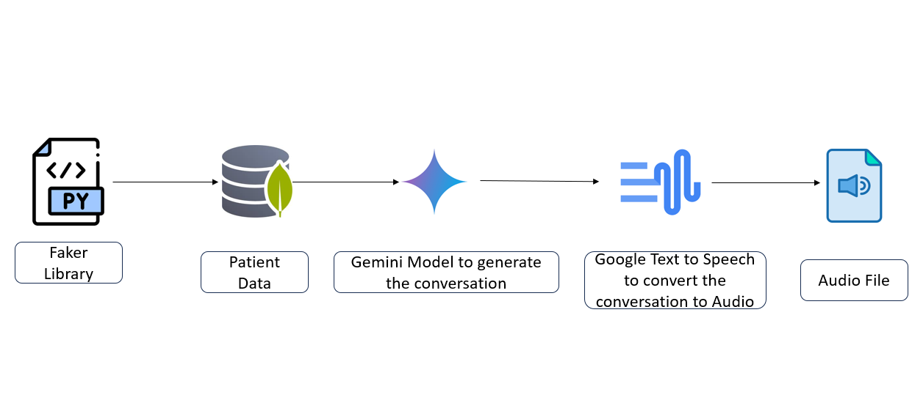
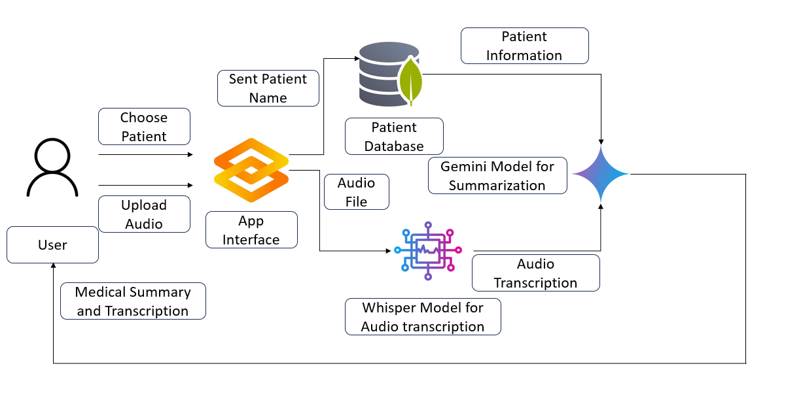

# 🩺 AI Clinical Summarization System

An intelligent application that transcribes doctor-patient conversations, generates a general summary, and produces a medically contextual summary using the patient's prior health history.

---

## 🚀 Overview

This project simulates a real-world AI system designed for clinical settings where doctors can:

1. Select a patient from a database (synthetic EHR).
2. Upload an audio recording of a consultation.
3. Receive:
   - A transcript of the consultation.
   - A general summary of the conversation.
   - A **medical summary** contextualized by the patient's historical data.

---

## 🧠 Features

- 🔬 **Synthetic EHR Generation** — Generates fake yet realistic patient data including conditions, medications, allergies, labs, and visit history.
- 💾 **MongoDB Integration** — Stores EHR data in MongoDB Atlas for later retrieval during summarization.
- 🤖 **Conversation Generation** — Uses Gemini LLM to simulate doctor-patient interactions based on EHR data.
- 🔉 **Text-to-Speech (TTS)** — Converts generated conversations to audio using different voices for doctor and patient.
- 📝 **Transcription** — Uses `faster-whisper` to convert uploaded conversation audio into text.
- 🩺 **Dual Summarization** — Uses Gemini to create:
  - General conversational summaries.
  - Medical summaries using the patient’s EHR data.
- 🧑‍⚕️ **Gradio UI** — Provides a simple, interactive interface for doctors to upload files and view results.

---
## 🧭 Synthetic Data Generation Architecture



---
## 🧭 AI Clinical Summarization Architecture



---

## 🛠️ Tech Stack

| Layer           | Technology                        |
|----------------|-----------------------------------|
| LLM             | Google Gemini 1.5 Flash          |
| Audio to Text   | `faster-whisper`                 |
| Text to Audio   | `gTTS`, `pydub`                   |
| EHR Storage     | MongoDB Atlas                     |
| UI              | Gradio                            |
| Data Generation | `faker`, `random`, Python         |

---

---

## 🔄 Workflow

1. **Generate synthetic EHR data**  
   → Save to `synthetic_ehr_data.json`

2. **Load EHR into MongoDB**  
   → Inserts records into `ehr_database.patients`

3. **Generate a doctor-patient conversation**  
   → Based on selected EHR record using Gemini

4. **Convert conversation to audio**  
   → Distinct voices for doctor and patient

5. **Transcribe and summarize audio via Gradio**  
   - Select a patient
   - Upload conversation audio
   - Get:
     - Transcript
     - General summary
     - Medically contextual summary

---

## 🧪 Example Use Case

A doctor selects “Andrew Harrison,” uploads their latest conversation in audio format. The system:

- Transcribes the conversation (e.g., symptoms discussed, medications)
- Summarizes the discussion in layman's terms
- Generates a professional summary referencing Andrew’s EHR (e.g., “Given the patient's history of asthma…”)

---

## 📦 Dependencies

Install required packages:

```bash
pip install faker pymongo google-generativeai gradio faster-whisper pydub gTTS


